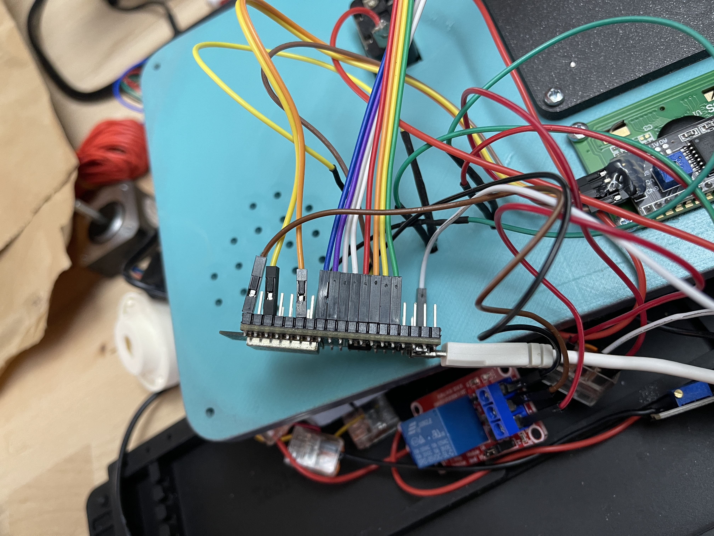

# paintball-search-and-destroy

## Clarification
This is not a real bomb. It don't explode. 
It just makes noise similar to an fire alarm.
It is build to add another gamemode for paintball.

## What is search and destroy?
This gamemode is adapted from CounterStrike.
2 teams play against each other.
Team 1:
- Name: Terrorist (T)
- Objective: Plant a bomb in a designated area and secure it till it explodes

Team 2:
- Name: CounterTerrorist (CT)
- Objective: Defend the plant areas and prevent the Terrorist from planting the bomb

## How it works
The case is 3D-printed from PLA. 
As a energy source I use a basic 5v Portable phone charging battery.
This powers the ESP-32 and the piezzo.
Between the battery and the piezzo is a 5v-12v step up to increase the volume of the piezzo.

When started, ESP-32 acts like a WLAN-AP and hosts a configuration website.
There you can adjust how long the CT side has to defuse a planted "bomb".
With the gTime setting you can adjust how long the Terrorists have to plant the bomb.

To plant or defuse you have to enter the S/N you can see on the copper shield.

The bomb signals with the piezzo and the red LED when it detonated.
The orange LED blinks when the bomb is armed.
